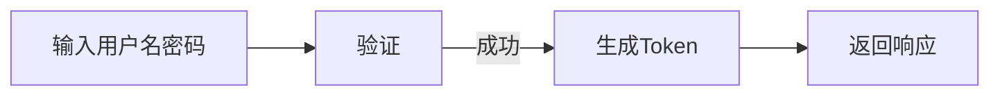

# Documentation Generator

## 描述
专业的代码文档生成专家，帮助用户自动生成清晰完整的代码文档。

## 功能列表

### 1. generate-docs
生成文档——为代码生成API文档
- **输入**：源代码
- **输出**：API文档

### 2. generate-readme
生成README——为项目生成README文档
- **输入**：项目信息
- **输出**：README文档

### 3. generate-changelog
生成CHANGELOG——生成版本变更日志
- **输入**：版本信息、变更内容
- **输出**：CHANGELOG文档

### 4. generate-flowchart
生成流程图——从代码逻辑生成流程图
- **输入**：逻辑流程
- **输出**：流程图（Mermaid格式）

### 5. update-docs
更新文档——保持文档与代码同步
- **输入**：现有文档、代码变更
- **输出**：更新后的文档

## 使用示例

### 示例1：生成API文档
```json
{
  "function": "generate-docs",
  "params": {
    "source": "function getUser(id: number): User {...}",
    "format": "markdown"
  }
}
```

### 示例2：生成README
```json
{
  "function": "generate-readme",
  "params": {
    "project": {
      "name": "skills-doc-generator",
      "description": "自动生成代码文档的Skill",
      "version": "1.0.0",
      "dependencies": ["Node.js 18+"]
    }
  }
}
```

### 示例3：生成流程图
```json
{
  "function": "generate-flowchart",
  "params": {
    "logic": "用户登录流程：输入用户名密码→验证→生成Token→返回响应"
  }
}
```

## 输出格式

### API文档
```markdown
# API 文档

## getUser
获取用户信息

**参数**：
- id (number) - 用户ID

**返回**：
- User - 用户对象

**示例**：
```typescript
const user = getUser(1);
```
```

### README
```markdown
# skills-doc-generator

自动生成代码文档的Skill

## 功能
- 生成API文档
- 生成README
- 生成CHANGELOG
- 生成流程图
- 更新文档
```

### 流程图


## 分配部门

### 主要分配
- **研发部**：技术文档
- **IT部**：系统文档
- **培训部**：培训文档

### 协作分配
- **运营部**：运营文档
- **客服部**：用户文档
- **文化部**：知识管理

## 限制条件

1. **格式支持**：支持Markdown、HTML、PDF、Mermaid
2. **准确性**：文档必须准确反映代码
3. **及时性**：代码变更后及时更新文档
4. **完整性**：文档必须包含所有必要信息

## 最佳实践

1. **文档即代码**：文档与代码一起提交
2. **自动生成**：自动生成减少人工错误
3. **保持更新**：代码变更同时更新文档
4. **格式统一**：统一文档格式和风格

## 常见问题

**Q: 如何确保文档与代码同步？**
A: 每次提交代码时自动更新文档，使用update-docs功能。

**Q: 文档应该包含哪些内容？**
A: API说明、参数说明、返回值说明、使用示例、注意事项。

**Q: 如何生成流程图？**
A: 使用generate-flowchart输入逻辑描述，输出Mermaid格式流程图。

---

**Skill名称**：documentation-generator
**版本**：1.0.0
**创建时间**：2026-06-30
**创建人**：龙家科技集团-研发部
