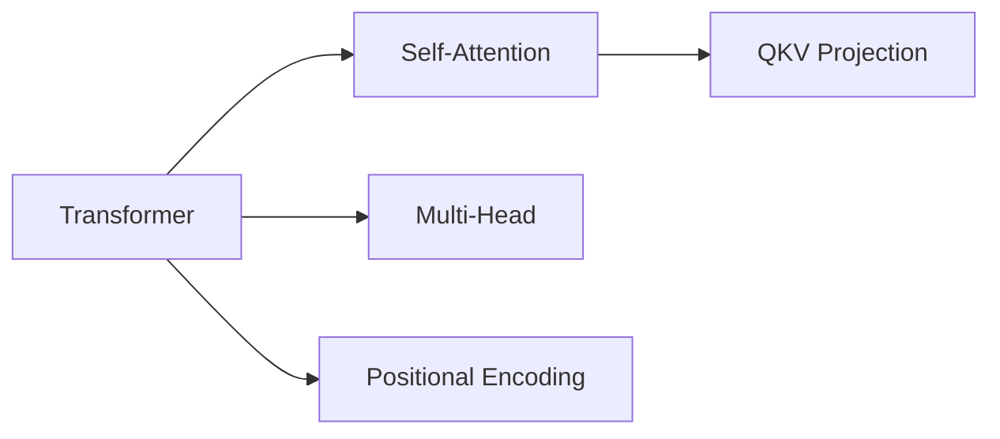

# gbrain-graph 模块

知识图谱是 gbrain 超越 ima 的核心能力——自动从文档中提取实体和关系，构建可探索的知识网络。

## 能力

1. **实体提取**: 自动识别文档中的人物、技术、概念、地点
2. **关系发现**: 实体间的引用、包含、依赖关系
3. **图谱查询**: "X 和 Y 有什么关系？" "哪些文档提到了 Z？"
4. **可视化**: 输出 Mermaid 格式图谱

## 如何工作

```
文档文本 → LLM 实体提取 → SQLite 关系存储 → 图谱查询响应
```

## 查询图谱

```bash
node lib/graph.js query --entity "<实体名>" --depth 2
```

## 示例

用户问："知识库里关于 transformers 和 transformers 的关系"

```bash
# 1. 搜索相关文档
node lib/search.js --query "transformers" --limit 5

# 2. 查询图谱
node lib/graph.js query --entity "Transformer" --depth 3
```

## 图谱渲染

使用 Mermaid 渲染关系图：


